# Meraki Wireless Location API 

## Building a Meraki CMX API receiver using Amazon Lambda & DynamoDB

This guide will walk through the process of building a
Meraki CMX WiFi location receiver using the AWS Lambda service by Amazon. The data will then be placed into DyanamoDB where it can optionally be indexed and searchable using ElasticSearch and visualized with Kibana.

## Resources
### Docs
* [Cisco Meraki Developers Portal](http://developers.meraki.com)

### Source Code
* [CMX Lambda - Inline Function](src/cmx-lambda-inline.js)
  * [CMX Lambda - POST Test](src/cmx-post-test.json)
  * [CMX Lambda - GET Test](src/cmx-get-test.json)
* [DynamoDB to ElasticSearch Lambda - Inline Function](src/cmxreceiver-stream-to-es.py)
* [Postman Example Collection](postman/CMX-AWS.postman_collection-environment-variables-required.json)


# Prerequisites
* Meraki Dashboard with MR Access Points
	* [Learn More](https://meraki.cisco.com/products/wireless)
* Amazon AWS account and intermediate experience
	* [Learn More](https://aws.amazon.com/)
* JavaScript & Python basic experience


# Technologies
## Cisco Meraki CMX Location API
Meraki MR access points are capable of gathering location information using standard WiFi (IEEE 802.11) and/or Bluetooth Beacons. By listening to wireless "probe requests", the access points are able to triangulate and identify wireless clients. This information is then available via the CMX API. Meraki will regularly POST an array of JSON objects which include the observations made by the wireless network. 

The JSON POST generally occurs every 30 to 60 seconds, but client updates could take as long as 2 minutes. This is because clients periodically "probe" and the APs periodically report their observations, resulting in some inconsistent reporting intervals.

**More info:** [Cisco Meraki CMX Whitepaper](https://documentation.meraki.com/MR/Monitoring_and_Reporting/CMX_Analytics#CMX_Location_API)

### Expected JSON Format (v2)
*Note: Observations are an array of objects reported by each AP*

```
{
  "apMac": <string>,
  "apTags": [<string, ...],
  "apFloors": [<string>, ...],
  "observations": [
    {
      "clientMac": <string>,
      "ipv4": <string>,
      "ipv6": <string>,
      "seenTime": <string>,
      "seenEpoch": <integer>,
      "ssid": <string>,
      "rssi": <integer>,
      "manufacturer": <string>,
      "os": <string>,
      "location": {
        "lat": <decimal>,
        "lng": <decimal>,
        "unc": <decimal>,
        "x": [<decimal>, ...],
        "y": [<decimal>, ...]
      },
    },...
  ]
}
```

## AWS Lambda
Lambda is great way to run a small section of code as a micro-service, without the requirement of provisioning any hardware. By using the provided source code and an AWS API Gateway, a CMX receiver can be built pretty easily and scale on demand.

More Info: [Lambda Manual](http://docs.aws.amazon.com/amazondynamodb/latest/gettingstartedguide/Welcome.html)


## AWS API Gateway

API Gateway is an AWS service that will act as a "front door" to the CMX Receiver. This project will essentially build a REST API to accept GET and POST methods. These methods will then trigger the CMX Receiver Lambda function.

More Info: [API Gateway Manual](http://docs.aws.amazon.com/apigateway/latest/developerguide/create-api-resources-methods.html)
   

## AWS DynamoDB
DynamoDB is a NoSQL database service provide by Amazon AWS. It will provide a fast and reliable database for collecting the high volumes of CMX location data.

More Info: [DynamoDB Manual](http://docs.aws.amazon.com/amazondynamodb/latest/gettingstartedguide/Welcome.html)


# Instructions
*These instructions assume a basic ability to navigate the Amazon AWS platform.*

* Create a DynamoDB table
  * **Table Name:** cmxdata
  * **Partition key:** message_id
  * **Sort key:** message_ts
   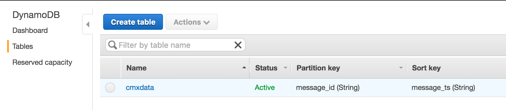

* Create an API Gateway
  * **API Gateway Name:** CMX
   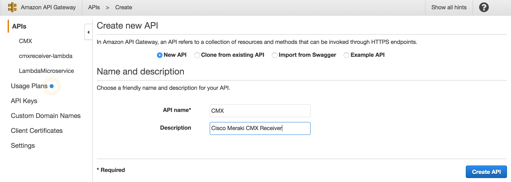


* Create a Lambda Function
  * **Name:** cmxreceiver-dynamodb
  * **Source Code:** [CMX Lambda Function](src/cmx-lambda-inline.js)
  * *skip the triggers and blueprint screens*
     * Update the **secret** and **validator** to match your settings Meraki Dashboard settings of the CMX POST URL.
   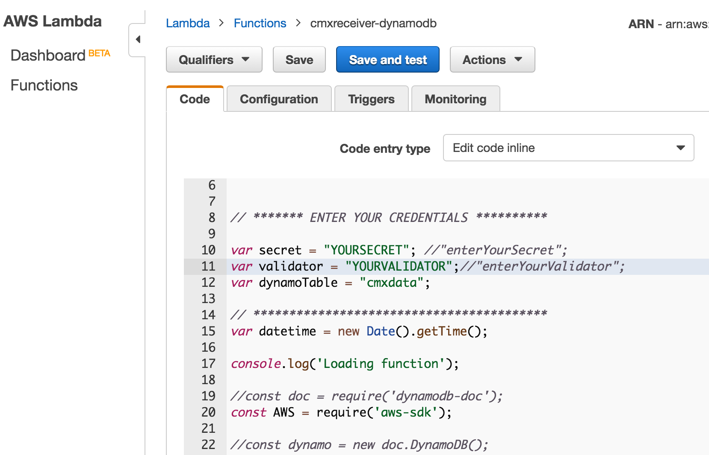
* Configuration Tab - Create an IAM service role with full access to DynamoDB.
   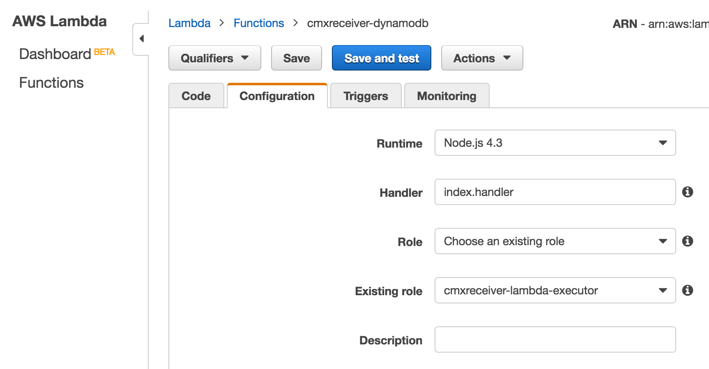
* Triggers Tab - Link an API Gateway trigger
  * **Trigger:** API Gateway
  * **API Name:** CMX
  * **Security:** Open
  * 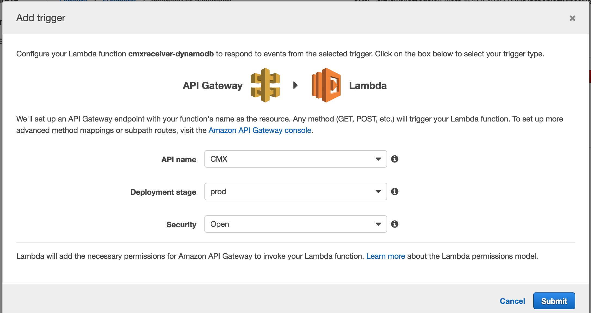
* The API Gateway trigger will now have a link to be used as your **CMX POST URL**
   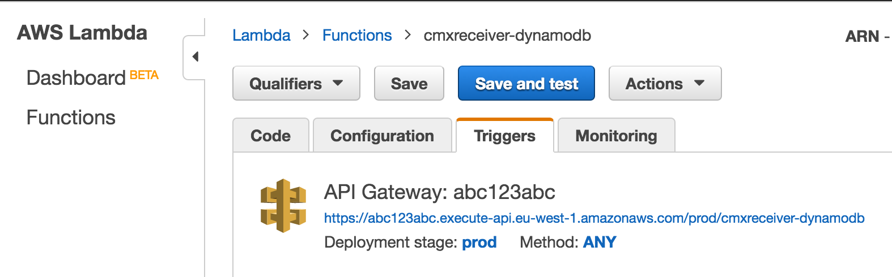

## Verify
* Use a Test Event (Actions --> Configure Test Event) to verify that your CMX receiver is responding with your validator key.
  * Test Event: ["GET Test" Source Code](src/cmx-get-test.json)
    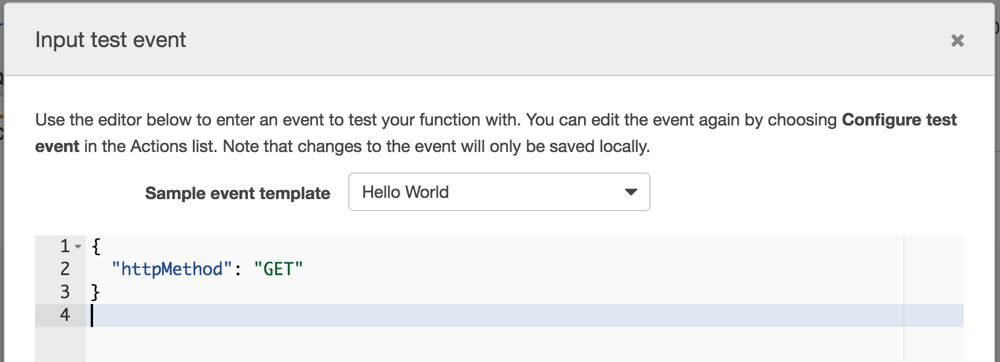
  * Test Result: Should show you the validator string. You can also test this by navigating to the API Gateway URL in any web browser or by sending a GET request using [PostMan](https://www.getpostman.com/)
  
    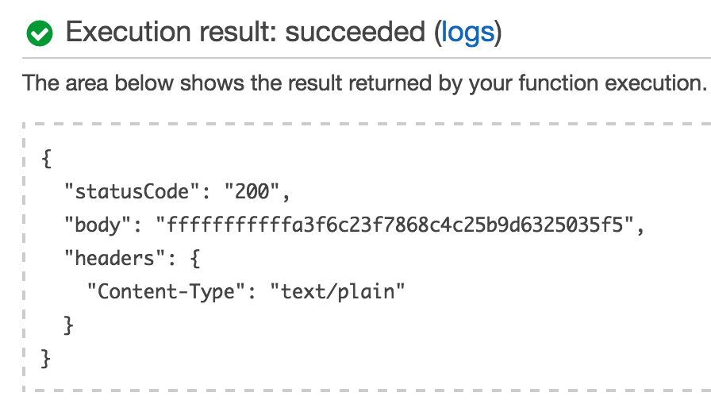
* Use a Test Event to verify that your CMX receiver is accepting the JSON post, verifying the secret and writing to DynamoDB.
  	* Test Event: ["POST Test" Source Code](src/cmx-post-test.json)

    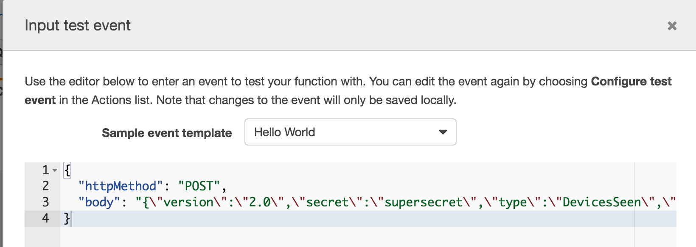
    
	* Test Result: 

	
    
    
* Cloudwatch Logs
	* Expand the message for "received CMX POST: {.." to view the JSON data. If an error occurs, this log stream will also provide any details.	
	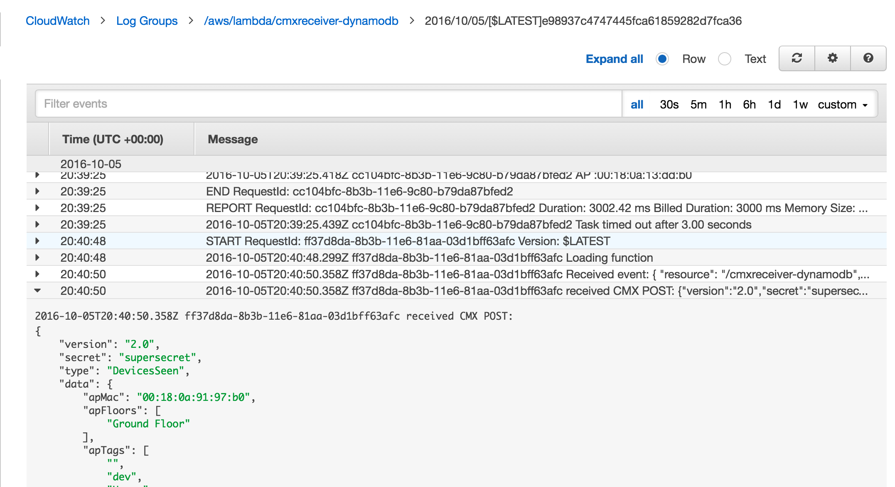


# Configure Meraki CMX POST URL
* Login to your Meraki Dashboard
* Network-wide --> Settings
* **CMX API:** enabled
* **Add a Post URL:** *your API Gateway URL*
* **Secret:** *the same secret you defined in the Lambda JavaScript inline code*
  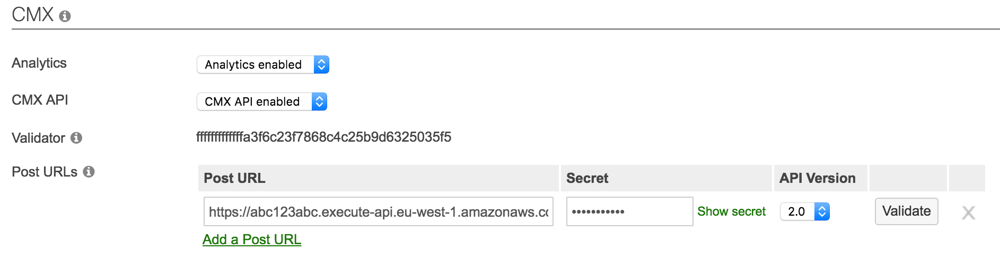


# AWS ElasticSearch & Kibana
Once the location data is stored in DynamoDB, indexing and data visualization are best handled by ElasticSearch and Kibana. ElasticSearch will index the database and provide a RESTful API to interact with the data. Kibana leverages this API and builds a flexible reporting and visualization tool.

Configuring these tools is generally an exercise with AWS and permissions which is outside the scope of this guide. To complete these steps, please read the following article on getting these components setup. Once completed, you should be able to readily query the location data and create reports. From there, front-end applications such as a map or advanced analytics can be created. The technology is pretty straightforward, but pay special attention to permissons, policies and the appropriate links required for each. Most troubleshooting will occur within these areas.

[Indexing DynamoDB with Elastic Search](https://aws.amazon.com/blogs/compute/indexing-amazon-dynamodb-content-with-amazon-elasticsearch-service-using-aws-lambda/)

*Note: Instead of using the Lambda function blueprint suggested in the article, use the provided modified version.  There were some updates with the AWS Lambda environement that have broken things since the original blueprint was created*

[DynamoDB to ElasticSearch Lambda - Inline Function](src/cmxreceiver-stream-to-es.py)

Modify your ES_ENDPOINT to match as explained in the instructions.
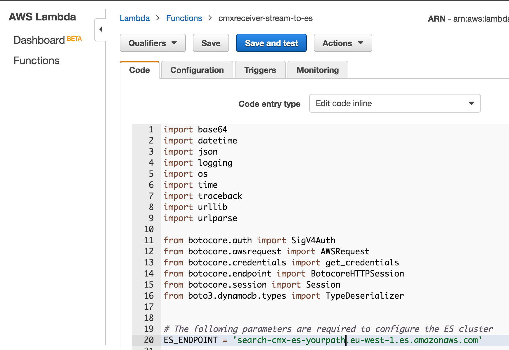


# Kibana Examples

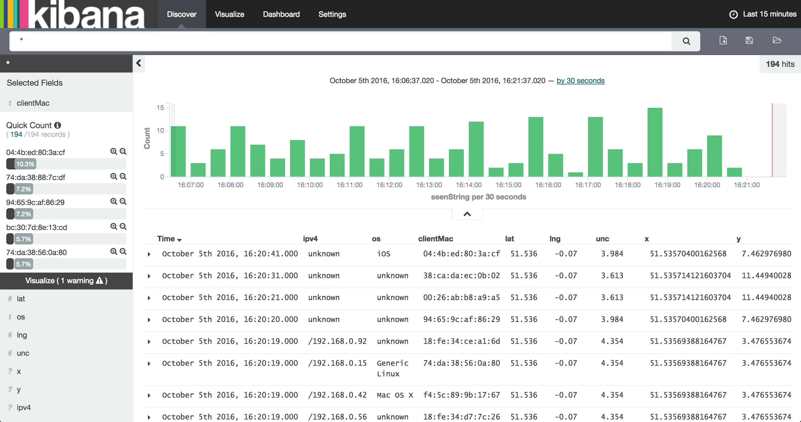

### Written by
Cory Guynn, 2016


http://www.InternetOfLEGO.com

http://developers.meraki.com/

Special thanks to Michael Eagles for his help on this!
