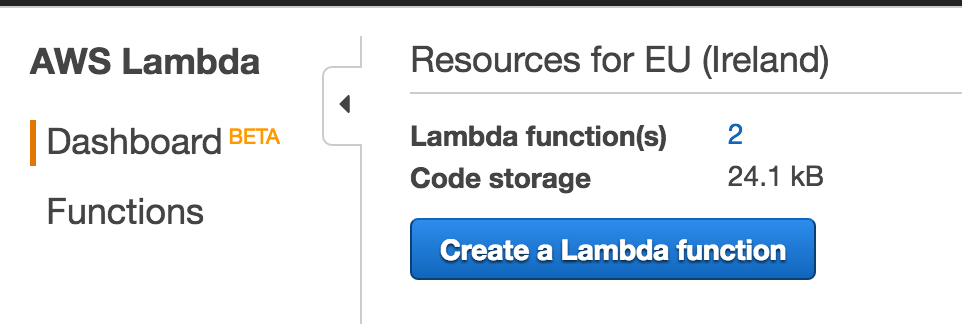

# Cisco Meraki Location Analytics - CMX API with AWS Lambda
## Building a Meraki CMX receiver using Amazon Lambda & DynamoDB

This lab will walk through the process of building a
Meraki CMX WiFi location receiver using the AWS Lambda service by Amazon. The data will then be placed into DyanamoDB where it can be indexed and searchable using ElasticSearch and visualized with Kibana.

## Resources
### Docs
* [Cisco Meraki Developers Portal](https://developers.meraki.com)

### Source Code
* [CMX Lambda - Inline Function](src/cmx-lambda-inline.js)
  * [CMX Lambda - POST Test](src/cmx-post-test.json)
  * [CMX Lambda - GET Test](src/cmx-get-test.json)
* [DynamoDB to ElasticSearch Lambda - Inline Function](src/cmxreceiver-stream-to-es.py)

# Prerequisites
* Meraki Dashboard with MR Access Points
* Amazon AWS account and intermediate experience
* JavaScript & Python basic experience

# Technologies
##  Meraki CMX Location API
Cisco Meraki MR access points are capable of gathering location information using WiFi. By listening to client probe requests, the access points are able to triangulate and identify wireless clients. This information is then available via the CMX API. Meraki will periodically POST an array of JSON objects which  include the observations made by the network.

## AWS Lambda
Lambda is great way to run a small section of code as a micro-service, without the requirement of provisioning any hardware. By using the source code provided and an AWS API Gateway, a CMX receiver can be built pretty easily and scale on demand.

## AWS DynamoDB
DynamoDB is a NoSQL database service provide by Amazon AWS. It will provide a fast and reliable database for collecting the high volumes of CMX location data.

# Instructions
These instructions assume basic skills with Amazon AWS. Links to helpful manuals can be found throughout this guide if you are new to AWS and related services.

* Create a DynamoDB table
  * **Table Name:** cmxdata
  * **Partition key:** message_id
  * **Sort key:** message_ts
  * More Info: [DynamoDB Manual](http://docs.aws.amazon.com/amazondynamodb/latest/gettingstartedguide/Welcome.html)
   
* Create an AWS API Gateway
  * **API Gateway Name:** CMX
  * More Info: [API Gateway Manual](http://docs.aws.amazon.com/apigateway/latest/developerguide/create-api-resources-methods.html)
   
* Create an AWS Lambda Function
  * **Name:** cmxreceiver-dynamodb
  * *skip the triggers and blueprint screens*
  * More Info: [Lambda Manual](http://docs.aws.amazon.com/lambda/latest/dg/welcome.html)
  * 
* Copy the provided JavaScript code into the in-line Code editor
  * **Source Code:** [CMX Lambda Function](src/cmx-lambda-inline.js)
  * Update the **secret** and **validator** to match your settings Meraki Dashboard settings of the CMX POST URL.
  * 
* Configuration Tab - Create an IAM service role  with full access to DynamoDB.
  * 
* Triggers Tab - Link an API Gateway trigger
  * **Trigger:** API Gateway
  * **API Name:** CMX
  * **Security:** Open
  * 
* The API Gateway trigger will now have a link to be used as your **CMX POST URL**
  * 

## Verify
* Use a Test Event to verify that your CMX receiver is responding with your validator key.
  * Test Event: ["GET Test" Source Code](src/cmx-get-test.json)
  
  * Test Result
  
* Use a Test Event to verify that your CMX receiver is accepting the JSON post, verifying the secret and writing to DynamoDB.
  * Test Event: ["POST Test" Source Code](src/cmx-post-test.json)
  
  * Test Result
  

# Configure Meraki CMX POST URL
* Login to your Meraki Dashboard
* Network-wide --> Settings
* **CMX API:** enabled
* **Add a Post URL:** *your API Gateway URL*
* **Add a Secret:** *the same secret you defined in the Lambda JavaScript inline code*
  

# AWS ElasticSearch & Kibana
Once the location data is stored in DynamoDB, indexing and data visualization are best handled by ElasticSearch and Kibana. ElasticSearch will index the database and provide a RESTful API to interact with the data. Kibana leverages this API and builds a flexible reporting and visualization tool.

Configuring these tools is mainly an exercise with AWS and permissions and outside the scope of this document. To complete these steps, please read this excellent article on getting started. Once completed, you should be able to readily query the location data and create reports. From there, front-end applications such as a map or advanced analytics can be created.

[Indexing DynamoDB with Elastic Search](https://aws.amazon.com/blogs/compute/indexing-amazon-dynamodb-content-with-amazon-elasticsearch-service-using-aws-lambda/)

*Note: Instead of using the Lambda function blueprint suggested in the article, use the provided modified version.  There were some updates with the AWS Lambda environement that have broken things since the original blueprint was created*

[DynamoDB to ElasticSearch Lambda - Inline Function](src/cmxreceiver-stream-to-es.py)

# Kibana Examples

### Written by
Cory Guynn, 2016

http://www.InternetOfLEGO.com

http://developers.meraki.com/

Special thanks to Michael Eagles for his help on this!
